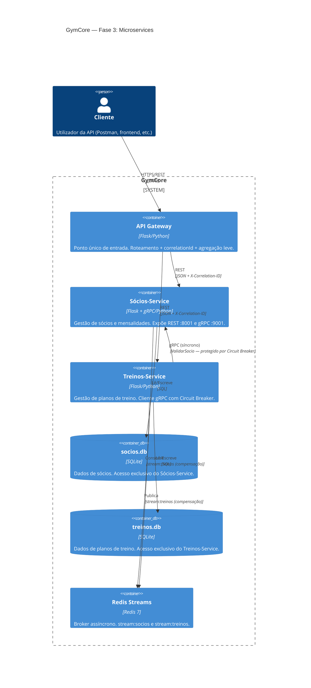
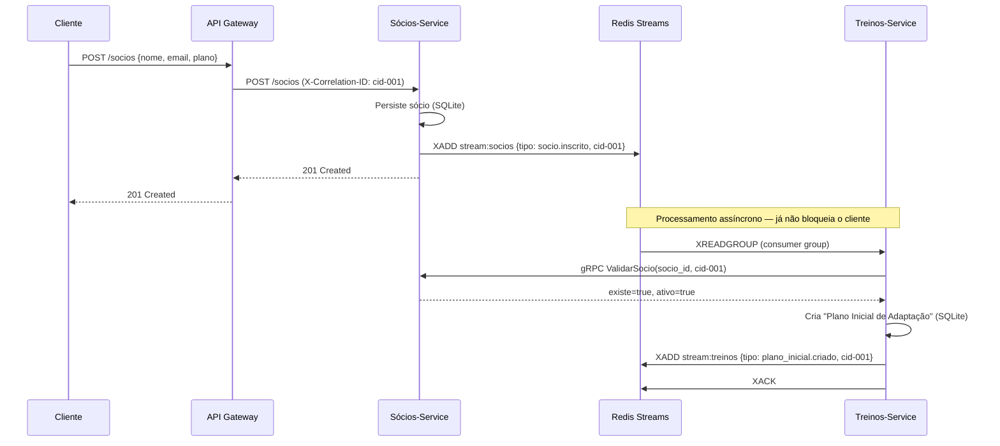
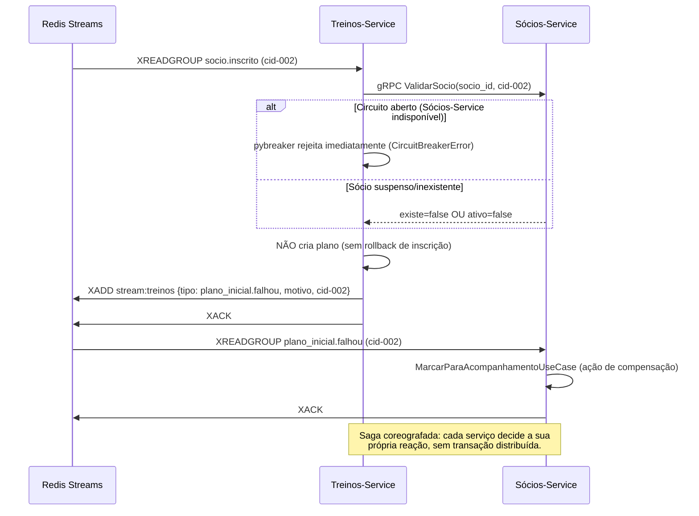
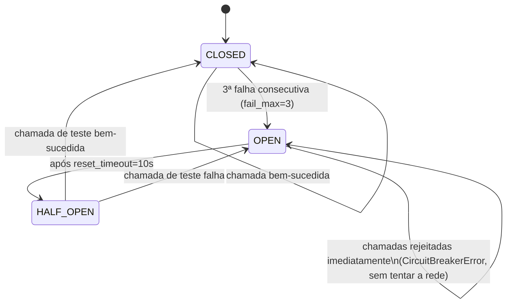

# Diagrama de Arquitetura — Fase 3 (Mermaid)

Visualizável em https://mermaid.live ou diretamente no GitHub/GitLab.

## Visão de Contentores (nível C4 — Container Diagram)

## Fluxo: Saga "Inscrição Completa" (sucesso)

## Fluxo: Saga "Inscrição Completa" (falha + compensação)

## Fluxo: Circuit Breaker (chamada síncrona gRPC)

